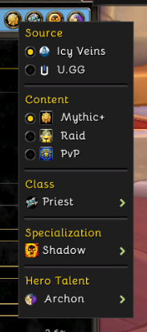

# Class Codex Companion

CC Companion is a standalone World of Warcraft Retail companion addon for Class
Codex. It remembers the selections in Class Codex's combined context menu, so
you do not have to change them every time you log into a different character.

## Features

- Remembers the selected **Source**: Icy Veins or U.GG
- Remembers the selected **Content**: Mythic+, Raid, or PvP
- Remembers the selected **Class**
- Remembers the selected **Specialization**
- Remembers the selected **Hero Talent**
- Restores the appropriate selections when you switch characters
- Keeps specialization-dependent choices separate
- Does not modify any Class Codex files

## Requirements

- World of Warcraft Retail
- Class Codex by Icy Veins installed and enabled

## Commands

- `/ccom status` — show the current specialization profile and profile count
- `/ccom sync` — immediately capture and restore the current profile
- `/ccom reset` — request deletion of CC Companion's shared data
- `/ccom reset confirm` — confirm the reset within 30 seconds

Resetting CC Companion does not delete Class Codex's own character data.

## Installation

1. Download or clone this repository.
2. Place the `cccompanion` folder inside:

   `World of Warcraft/_retail_/Interface/AddOns/`

3. Ensure Class Codex and CC Companion are enabled in the AddOns menu.
4. Restart World of Warcraft or type `/reload`.

## Author

Created by **BoojiePanda (SilverRavyn)**.

## License

Licensed under the zlib License. See [LICENSE](LICENSE).
